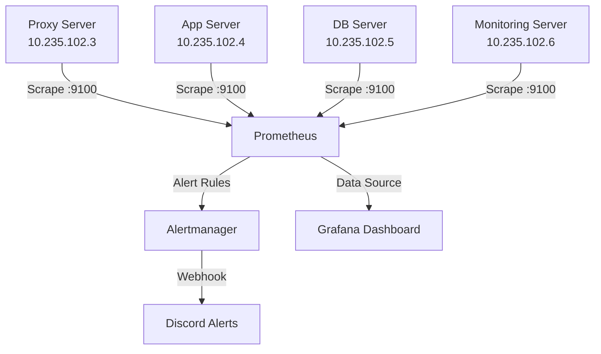

# 02 - Centralized Monitoring & Alerting

> A complete observability stack deployed on IDCloudHost, providing real-time metrics, visualization, and instant Discord notifications when servers go down or resources reach critical levels.

## 🏗️ Architecture

## 🛠️ Tech Stack

- **Metrics:** Prometheus, Node Exporter
- **Visualization:** Grafana
- **Alerting:** Alertmanager + Discord Webhook
- **OS:** Ubuntu 22.04 LTS

## 🔐 Security Features

- **Private network scraping:** All metrics are scraped over the private `10.235.102.x` network.
- **UFW hardening:** Ports `9090` (Prometheus UI) and `9093` (Alertmanager) are locked down and only reachable via SSH tunnel (`ssh -L 9090:localhost:9090 ...`). Grafana is publicly accessible via Nginx on port 80.

## 📂 Repository Structure

- `configs/prometheus/` — Prometheus configuration and alert rules.
- `configs/alertmanager/` — Alertmanager routing and Discord webhook configuration.
- `scripts/` — Node Exporter installation script.

## 🧪 Verification Results

1. **All targets up:** Prometheus successfully scrapes metrics from 4 servers (`proxy`, `app`, `db`, `monitoring`) plus cAdvisor for Docker containers.
2. **Real-time alerts:** Intentionally stopping Node Exporter triggers an `InstanceDown` alert, pushed to Discord within seconds.
3. **Network isolation:** Accessing Prometheus directly from the internet (port 9090) times out, confirming UFW policies are enforced.

---

Part of the IDCloudHost Cloud Architecture Portfolio.
